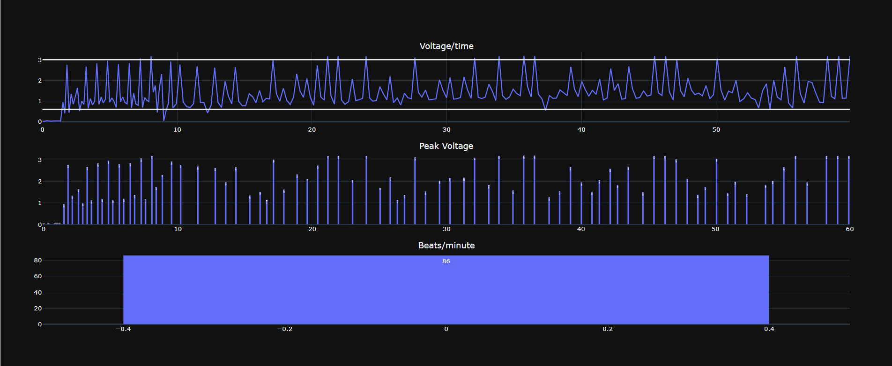

# core.py: 

1. Collect [time, voltage] data when a pulse pressure is found
2. Measure heart rate in beats per minute (bpm)
3. If not 80 < bpm < 40: Turn on air pump; else: Turn off pump

# data_vis.py:

